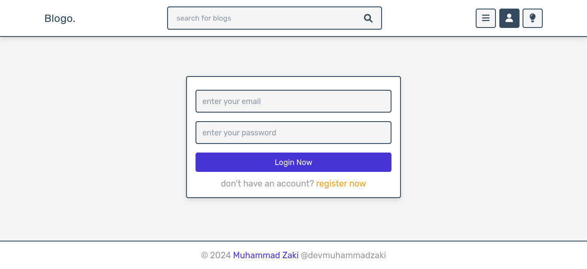

# Blogo

Comprehensive Responsive Blogging Website Design utilizing HTML, CSS, JavaScript, PHP, MySQL, PDO, and FontAwesome.

# Usage

1. Clone the repo & cd into the project's folder:

```bash
git clone https://github.com/devmuhammadzaki/blogo.git && cd blogo
```

2. Run PHP localserver:

```bash
php -S localhost:8000 -t .
```

and now you can access the website by writing: localhost:8000 in your browser's address bar! ;)

**Note**: _You can access the admin login page by writing: localhost:8000/admin/admin_login.php_

# Screenshots





